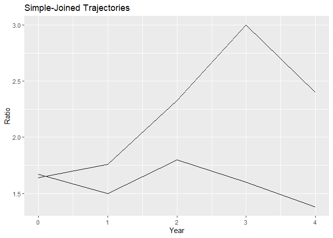
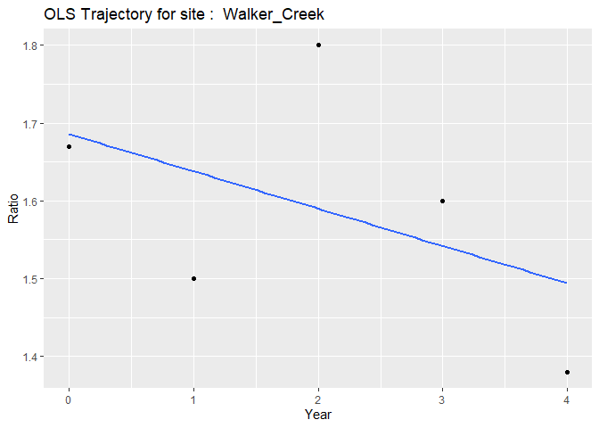
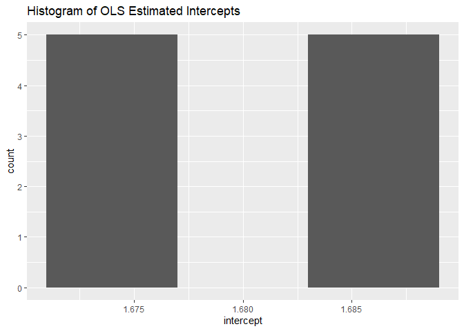

<!-- README.md is generated from README.Rmd. Please edit that file -->

# OLStrajr

<!-- badges: start -->
<!-- badges: end -->

The [Maximizing the Yield of Small Samples in Prevention Research: A
Review of General Strategies and Best
Practices](https://doi.org/10.1007%2Fs11121-014-0542-7) paper by Hopkin,
Hoyle, and Gottfredson (2015) suggests that when working with small
sample sizes, analysts should leverage plots to explore within-group
associations between predictor variables and the outcome variable. These
plots are intended to provide detailed insights about the data rather
than to be used for generalizing to the population.

The paper cites the work of [Carrig, Wirth, and Curran
(2004)](http://dx.doi.org/10.1207/S15328007SEM1101_9) who proposed an
easy-to-use SAS macro for visualizing person-specific growth
trajectories with repeated measures data.

The objective of the OLStrajr package is to bring the functionality of
this SAS macro, OLStraj, to R. While the original link to the macro in
Carrig’s paper is no longer active, it can still be accessed through the
[Wayback Machine](https://archive.org/web/).

## Installation

You can install the development version of OLStrajr as follows:

``` r
# install.packages("devtools")
devtools::install_github("mightymetrika/OLStrajr")
```

## Ratio of Robin Males to Females

This serves as an exemplary demonstration of using OLStrajr. It features
an analysis of data representing the yearly ratio of male to female
robins, as documented in [Birds: incomplete counts—five-minute bird
counts Version
1.0](https://www.doc.govt.nz/documents/science-and-technical/inventory-monitoring/im-toolbox-birds-incomplete-five-min-counts.pdf).
This data, collected at Walker Creek and Knobs Flat from August 2005 to
August 2009, provides a compelling case study

``` r
# Load package
library(OLStrajr)

# Get robins data
data(robins)
```

### OLStraj

To obtain the OLS trajectories, use the following code:

``` r
robins_traj <- OLStraj(data = robins,
                      idvarname = "site",
                      predvarname = "Year",
                      outvarname = "Ratio",
                      varlist = c("aug_05", "aug_06", "aug_07", 
                                  "aug_08", "aug_09"),
                      timepts = c(0, 1, 2, 3, 4),
                      regtype = "lin",
                      int_bins = 3,
                      lin_bins = 3)
```

The OLStraj function provides several types of plots that facilitate the
examination of your data:

### Group Plots:

``` r
robins_traj$group_plots
#> $simple_joined
```



    #> 
    #> $ols
    #> `geom_smooth()` using formula = 'y ~ x'


Group plots depict the simple-joined trajectories and the estimated
trajectories for each group in your data, allowing for a quick
comparison of trends across different groups.

### Individual OLS Trajectories:

``` r
robins_traj$individual_plots
#> $`ols Knobs_Flat`
#> `geom_smooth()` using formula = 'y ~ x'
```


    #> 
    #> $`ols Walker_Creek`
    #> `geom_smooth()` using formula = 'y ~ x'


Individual plots represent each subject’s unique trajectory over time,
providing insights into individual patterns of change.

### Histograms for intercepts and slopes:

``` r
robins_traj$histogram_plots
#> $intercepts
```


    #> 
    #> $slopes



These histograms reveal the distribution of intercepts and slopes across
subjects. They are useful for identifying skewness or other interesting
distributional properties in the data.

### Box plots of intercepts and slopes:

``` r
robins_traj$box_plot
```



Box plots provide a summary of the distribution of intercepts and slopes
across subjects. They allow you to visualize the spread and skewness of
the data. Any outliers are clearly highlighted in these plots. In the
OLStraj box plots, the mean value is represented by a blue dot.
Additionally, each outlier is labeled with the corresponding subject
identifier, providing a straightforward way to identify subjects whose
data deviate significantly from the rest of the group.
